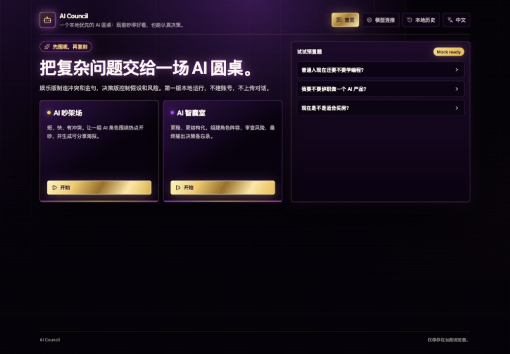
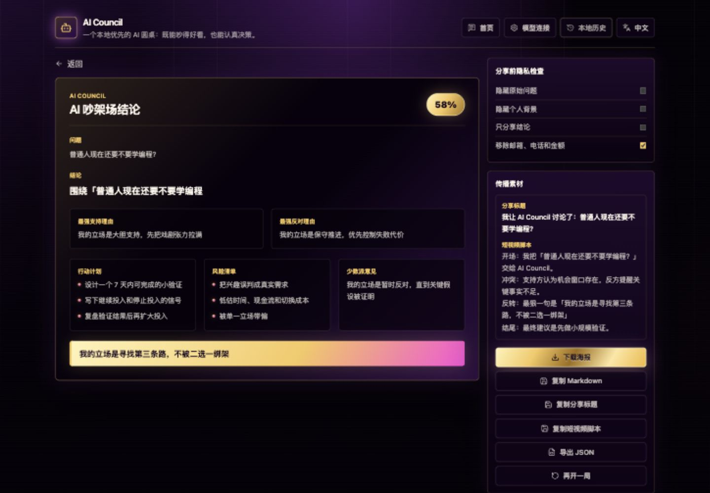

# AI Council

AI Council is a frontend-first tool for bringing multiple AI roles into one structured meeting: quick reviews for fast judgment, and decision meetings for deeper analysis.





## Product Direction

- **Quick Review**: fast evaluation for trade-offs, assumptions, risks, and a first actionable memo.
- **Decision Meeting**: deeper analysis for strategy, stakeholders, dissent, risk review, and next steps.
- **BYOK / BYOP**: users bring their own API keys or proxy URLs. The project does not provide model service, store API keys, or pay model costs.
- **Local-first exports**: v1 avoids an official public gallery. Image exports, Markdown, JSON, copied summaries, and history stay local unless the user shares them manually.
- **Bilingual by default**: the UI supports Chinese and English, auto-selecting the browser language while keeping a manual switch.

## Tech Stack

- React
- Vite
- TypeScript
- Tailwind CSS
- Zustand
- IndexedDB

## License

Apache-2.0

## Live App

The hosted frontend is available at:

```text
https://android-notes.github.io/ai-council/
```

The app is BYOK/BYOP. It does not include model credits, a hosted model service, or server-side key storage.

## Local Development

```bash
npm install
npm run dev
npm run build
npm run lint
```

## Relay Deployment And Configuration

Some model providers and aggregators block browser CORS. If direct browser calls fail, deploy your own relay and use that relay as the model Base URL.

The relay still uses each user's own API key. Do not put model API keys into GitHub, Vercel, Netlify, or Cloudflare project settings.

### One-Click Deploy

[](https://vercel.com/new/clone?repository-url=https%3A%2F%2Fgithub.com%2Fandroid-notes%2Fai-council&project-name=ai-council&repository-name=ai-council&demo-title=AI%20Council&demo-url=https%3A%2F%2Fandroid-notes.github.io%2Fai-council%2F)
[](https://app.netlify.com/start/deploy?repository=https%3A%2F%2Fgithub.com%2Fandroid-notes%2Fai-council)
[](https://deploy.workers.cloudflare.com/?url=https%3A%2F%2Fgithub.com%2Fandroid-notes%2Fai-council)

Recommended for the lowest setup friction: Vercel or Netlify. Recommended for higher free request volume: Cloudflare.

### Deploy On Netlify

1. Click **Deploy to Netlify**.
2. Log in with GitHub and authorize the repository import.
3. Pick a globally unique project name. Enter only the project slug, not a full URL.
   - Good: `ai-council-relay-yourname`
   - Bad: `https://ai-council.netlify.app`
4. Keep the default build settings from `netlify.toml`.
5. Click deploy.
6. After deploy, Netlify shows a site domain such as:

```text
https://your-site.netlify.app
```

Health check:

```text
https://your-site.netlify.app/api/health
```

If it returns `{"ok":true,...}`, the relay is ready.

### Deploy On Vercel

1. Click **Deploy to Vercel**.
2. Log in with GitHub and import the repository.
3. Keep the default Vite settings from `vercel.json`.
4. Click deploy.
5. After deploy, Vercel shows a project domain such as:

```text
https://your-project.vercel.app
```

Health check:

```text
https://your-project.vercel.app/api/health
```

### Deploy On Cloudflare

1. Click **Deploy to Cloudflare**.
2. Log in to Cloudflare. If GitHub social login fails, sign up with email/password and connect GitHub after login.
3. Follow the Deploy to Workers flow.
4. After deploy, Cloudflare shows a Worker domain such as:

```text
https://your-worker.workers.dev
```

Health check:

```text
https://your-worker.workers.dev/health
```

Cloudflare can also be deployed from GitHub Actions after adding `CLOUDFLARE_API_TOKEN` and `CLOUDFLARE_ACCOUNT_ID` repository secrets. See [docs/deployment.md](docs/deployment.md).

### Base URL Patterns

Use the deployed relay domain as the prefix.

For Vercel or Netlify:

| Provider | Protocol In AI Council | Base URL |
| --- | --- | --- |
| OpenAI | OpenAI-compatible Chat Completions | `https://your-site.netlify.app/api/openai/v1` |
| DeepSeek | OpenAI-compatible Chat Completions | `https://your-site.netlify.app/api/deepseek` |
| Anthropic | Anthropic Messages | `https://your-site.netlify.app/api/anthropic/v1` |
| Gemini | Gemini | `https://your-site.netlify.app/api/gemini/v1beta` |
| OpenRouter | OpenAI-compatible Chat Completions | `https://your-site.netlify.app/api/openrouter/api/v1` |

For Cloudflare:

| Provider | Protocol In AI Council | Base URL |
| --- | --- | --- |
| OpenAI | OpenAI-compatible Chat Completions | `https://your-worker.workers.dev/openai/v1` |
| DeepSeek | OpenAI-compatible Chat Completions | `https://your-worker.workers.dev/deepseek` |
| Anthropic | Anthropic Messages | `https://your-worker.workers.dev/anthropic/v1` |
| Gemini | Gemini | `https://your-worker.workers.dev/gemini/v1beta` |
| OpenRouter | OpenAI-compatible Chat Completions | `https://your-worker.workers.dev/openrouter/api/v1` |

Example DeepSeek setup with a Netlify relay:

```text
Protocol: OpenAI-compatible Chat Completions
Base URL: https://your-site.netlify.app/api/deepseek
Model ID: deepseek-chat
API key: paste your own DeepSeek key in the AI Council UI
```

### Configure AI Council

1. Open the app.
2. Go to **Models** or start a meeting until the API key modal appears.
3. Add or edit a model connection.
4. Pick the provider preset, or set the protocol manually.
5. In **Base URL**, use the in-app relay helper. It shows the recommended Netlify/Vercel URL for the selected provider and explains the route suffix.
6. For DeepSeek through this relay, the suffix is `/api/deepseek`: `/api` is the Netlify/Vercel relay entry and `/deepseek` tells the relay to forward to DeepSeek. AI Council appends `/chat/completions` and `/models` automatically.
7. Enter the model ID.
8. Paste your provider API key in the AI Council UI.
9. Click **Test connection**.

## Release Checklist

```bash
npm ci
npm run lint
npm run build
```

Before publishing, confirm GitHub Pages is set to **GitHub Actions** in the repository settings.

## Usage

1. Open the app.
2. Add a model connection with your own API key before starting.
   - OpenAI official: `https://api.openai.com/v1`
   - DeepSeek official: `https://api.deepseek.com`
   - Anthropic: `https://api.anthropic.com/v1`
   - Gemini: `https://generativelanguage.googleapis.com/v1beta`
   - Ollama local: `http://localhost:11434`
   - OpenRouter or compatible relay: `https://openrouter.ai/api/v1`
   - Custom relay or self-hosted proxy: use its OpenAI-compatible `/v1` base URL.
   - Custom JSON endpoint: provide the exact POST endpoint and return a common text field such as `content`, `text`, `response`, `output_text`, `choices`, or Gemini-style `candidates`.
3. Click **Fetch models** to load model IDs when the endpoint supports it.
4. If the browser blocks CORS, use your own Worker, Function, local proxy, or compatible relay endpoint.
5. Build a council lineup. New roles default to a configured model seat with an API key.
6. Export the result as an image, Markdown, JSON, memo title, or briefing summary.
7. Keep everything local unless you manually share an exported asset.

For deployment, see [docs/deployment.md](docs/deployment.md).
For privacy and key-handling details, see [docs/security.md](docs/security.md).

## v1 Provider Scope

- OpenAI-compatible Chat Completions adapter for relay, aggregator, and self-hosted compatible endpoints.
- OpenAI Responses adapter.
- Anthropic Messages adapter.
- Gemini `generateContent` adapter.
- Ollama native `/api/chat` adapter, plus LM Studio-style `/v1` compatibility.
- Custom JSON POST adapter for self-hosted endpoints and relay services.
- Model discovery through OpenAI-compatible `/models`, Anthropic `/models`, Gemini `/models`, and Ollama `/api/tags` endpoints when CORS allows.

## Current v1 Shell

- Chinese and English UI with browser-language auto detection and manual switching.
- API-key-gated review/decision flow from question input to meeting plan, staged meeting, result page, and local history.
- Model connection screen with OpenAI-compatible, OpenAI Responses, Anthropic, Gemini, Ollama/LM Studio, and Custom JSON connection testing.
- Editable role prompts, model seats, and model-failure fallback policy before each session.
- Local privacy-first result export through image download, Markdown copy, JSON export, memo title, and briefing summary.
- Council diversity scoring to nudge users from one model seat toward richer multi-model lineups.

## What AI Council Does Not Provide

- Hosted model service
- Official public conversation gallery
- Server-side account system
- Server-side conversation storage
- Server-side API key storage
- Model usage credits or billing coverage

See [docs/product-spec.md](docs/product-spec.md) for the MVP interaction model and required safety modules.
